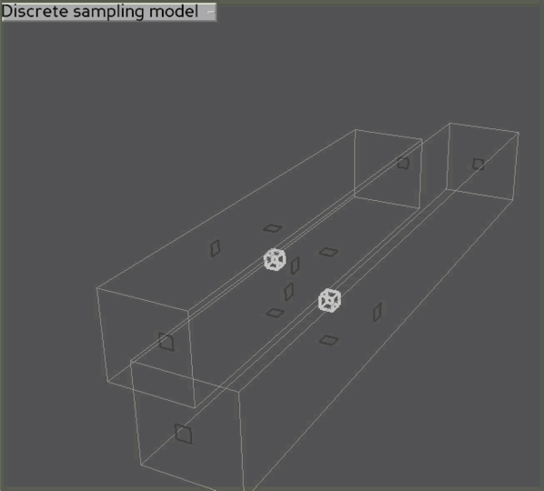

# visualization

## Overview

This folder contains tools to visualize instances of individual 4D trajectories simulated with various motion models, which hopefully correspond to collision models of interest.

## Usage

### Prerequisites

* Python 3 installed on system and accessible at command line

### Preparation

Starting in this working directory:

1. [Optional, but recommended] [Create a new virtual environment](https://docs.python.org/3/library/venv.html): `python3 -m venv collision_modeling_env`
2. [Activate virtual environment](https://docs.python.org/3/library/venv.html#how-venvs-work)
   1. Linux & Mac: `source collision_modeling_env/bin/activate`
   2. Windows: `collision_modeling_env\Scripts\activate.bat`
3. Install required packages: `pip install -r ../requirements.txt`

### Run

To run the motion model visualizer, start in this working directory and:

1. (If virtual environment is not currently activated) Activate virtual environment (see Preparation above)
2. Run visualizer: `python animate_simulations.py`

## Visualizer behavior

The `animate_simulations` visualizer uses the user-selected motion model (change selected model by clicking on model name and selecting a different one) to generate a particular, finite, random instance of aircraft trajectories -- this is called an "encounter".  That encounter is animated in 3D until it ends, at which point another random encounter is generated using the selected model.

The white boxes are aircraft bounding boxes -- a collision is deemed to have occurred if there is any intersection between these two boxes.  The light gray boxes are operational intent volumes -- aircraft are expected to stay within these volumes 95% of the time per OPIN0005.  The dark gray boxes are orthographic shadows of the white boxes projected onto the sides of the operational intent volumes.  Aircraft outside their volumes include red annotations.

## Motion models

### [discrete_sampling_model](discrete_sampling_model.py)

This model implements the motion behavior for aircraft in nominal circumstances described in ASTM's initial [UTM standard safety case proposal](https://docs.google.com/presentation/d/1C2EFaY76GnxT3P-fgpjBp6IaxfG3ucRHQiBCIBkpjKE).

In this model, the aircraft has an intended ideal trajectory that it generally follows by creating key points at an exact "sampling frequency".  Each key point (sample) corresponds with the position on the ideal trajectory, but then deviations from that ideal position are applied by drawing 0-mean values from normal distributions in each primary axis (lateral, vertical, longitudinal).  Deviations for separate key points (samples) are independent from each other -- that is, a deviation at one time point has no impact on the deviation for the next time point.  The scales of the distributions from which deviations are drawn are defined by aircraft performance, and operational intent volumes are formed such that 95% of samples fall within volumes (per ASTM F3548-21).  Aircraft position is interpolated linearly between key points.

A key parameter of this model is the sampling frequency.  Even holding fraction of samples inside volumes at 95%, aircraft may have different behavior with regard to how much jitter they have per time.  A high sampling frequency means that collisions will be more likely per amount of time as the likelihood of aircraft overlap increasing as the number of trials (samples) increases.  In the limit of an infinite sample rate, aircraft are always guaranteed to collide with 100% probability.  This jittery behavior is sometimes referred to as "caffeination" -- an aircraft with a high sampling frequency has high "caffeination" and jitters a lot.

The sampling frequency characteristic can be constrained to a single value via a number of methods.  This model canonically uses sampling frequency to determine caffeination, but ASTM F3548-21 constrains caffeination by setting a maximum number of excursions from defined volumes per hour (OPIN0005), and either value (sampling frequency or excursion count per time) can be determined from the other.

The Reich model uses speed along each primary axis at loss of separation in that axis as input parameters.  Since 95% containment and sampling frequency fully determine probabilistic motion behavior in this discrete sampling model, the average aircraft speed as it exits its volume can be computed.  Likewise, the inverse operation can be performed such that the sampling frequency necessary to produce a given average aircraft speed as it exits its volume can be computed -- this is implemented in [`infer_caffeination`](discrete_sampling_model.py).

### [reich_model](reich_model.py)

This model attempts to implement a motion behavior for aircraft that leads to an analysis of collision probability/rate consistent with that described in "A Unified Framework for Collision Risk Modelling in Support of the Manual on Airspace Planning Methodology for the Determination of Separation Minima (Doc 9689)".  Confidence that this model accurately represents the assumptions of the Reich model is low and suggestions for improvement are welcomed.

The approach taken by this attempt at implementing a motion model matching the Reich collision estimation model is to examine overlap between two aircraft on parallel tracks separately in each of the primary axes.

### Longitudinal overlap

Each encounter is constrained to have longitudinal overlap at x=0, and aircraft movement in the x axis is derived from the combination of that assumption and the given longitudinal aircraft velocities.  The encounter time window is ensured to be long enough to capture the entire period of longitudinal overlap, but this means that this model cannot generate reasonable encounters when the difference in longitudinal velocity between two aircraft is very small or zero.

### Lateral overlap

The conceptual model used to achieve lateral overlap is that an aircraft remains exactly in the lateral center of its volumes until a certain point when the aircraft suddenly deviates laterally at a fixed speed until a particular lateral deviation target distance is achieved, at which point the aircraft reverses direction and returns to the lateral center of its volumes at the same speed.  This lateral speed during deviation (relative to the other aircraft) is a primary input of the Reich model.

The actual absolute lateral speeds of each aircraft are chosen randomly, but constrained so that 1) the average relative lateral speed matches the input parameter and 2) movement is always toward the other aircraft.  Likewise, the lateral deviation sizes are chosen randomly, but always selected so that full overlap will be achieved exactly at the apex of the deviation.  These lateral deviation sizes are chosen to match the probability density of where actual overlaps would occur given the aircraft position distribution inferred by a normal distribution applied to the operational intent volumes.

Reich assumes probability of lateral overlap is proportional to the fraction of lateral spacing occupied by the aircraft.  To adjust the guaranteed lateral overlap described above, the times at which the aircraft initiate their lateral deviation is offset randomly.  This offset is chosen from a uniform distribution sized to achieve a probability of lateral overlap equal to the fraction of lateral spacing occupied by the aircraft.  _This seems to be a very odd or contrived assumption from the perspective of the rest of this motion model._  Depending on the ratio of lateral spacing to aircraft size, this may mean that the deviation maneuver of one or both aircraft may be initiated after or completed before the time window covered by the encounter.  As a result, such paths will show no lateral movement during the encounter (and there is guaranteed to be no collision because longitudinal overlap only occurs during the encounter time window).

### Vertical overlap

Currently, this motion model borrows its vertical overlap logic from the discrete sampling model, and only samples once from the position distribution for the entire duration of the encounter.  This does not seem to be representative of the Reich model, nor reality given the single-sample constraint.  The Reich model includes a `delta_z` parameter indicating the average relative vertical speed between aircraft at the time of vertical overlap, but this is currently not used.  We also seem to have an unreasonably high value for this speed given that there is nominally no deviation required to achieve overlap (the speed at overlap is not biased toward a high value like the average lateral speed at lateral overlap because vertical overlap can occur very close to nominal vertical positions, unlike lateral overlap).  This component of the motion model certainly needs to be updated.

### Encounter rate

The rate of encounters like the ones visualized with this model appears to be fairly obvious in many cases: encounters occur as frequently as aircraft on the parallel path are encountered, and this is directly related to the longitudinal spacing of the stream of air traffic on the parallel path.  However, this analogy breaks down somewhat in the limit where relative longitudinal speed approaches zero -- in that case, the probability of longitudinal overlap should be high and independent of relative longitudinal speed.
